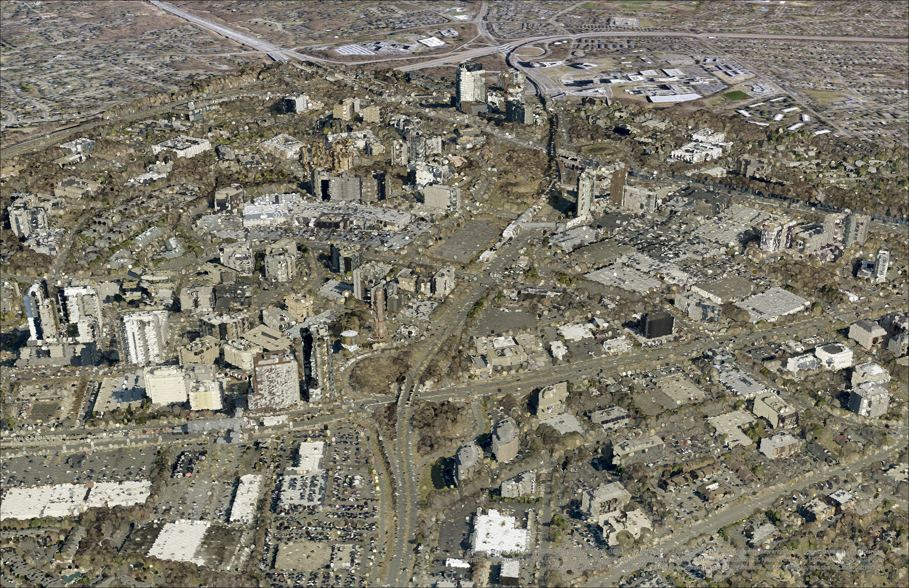
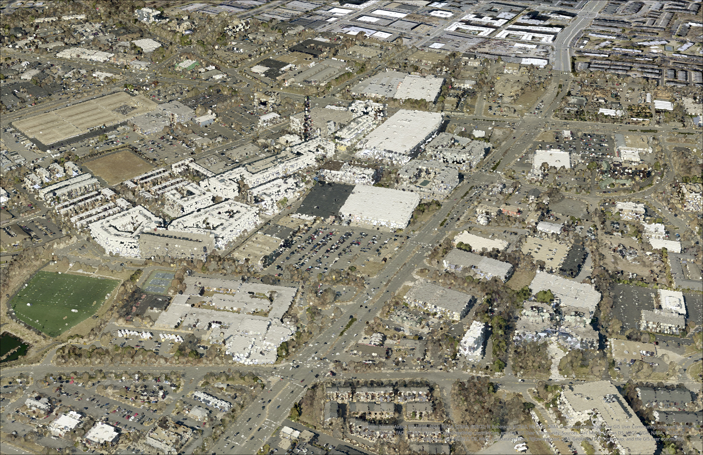
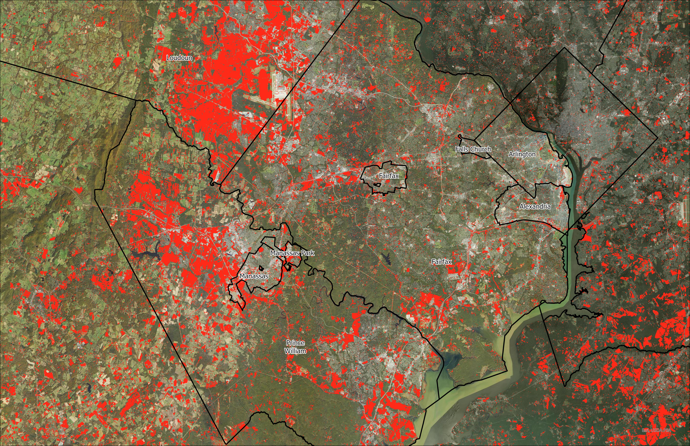
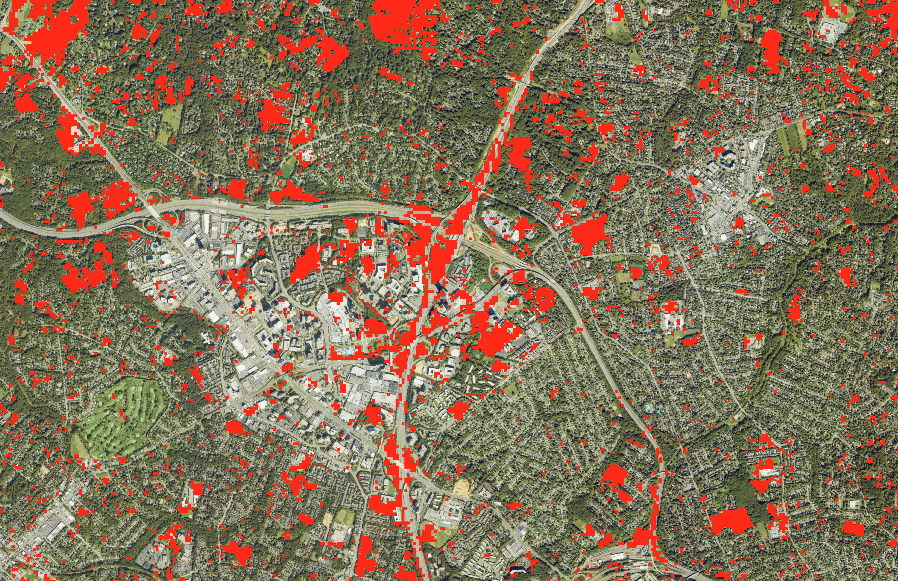
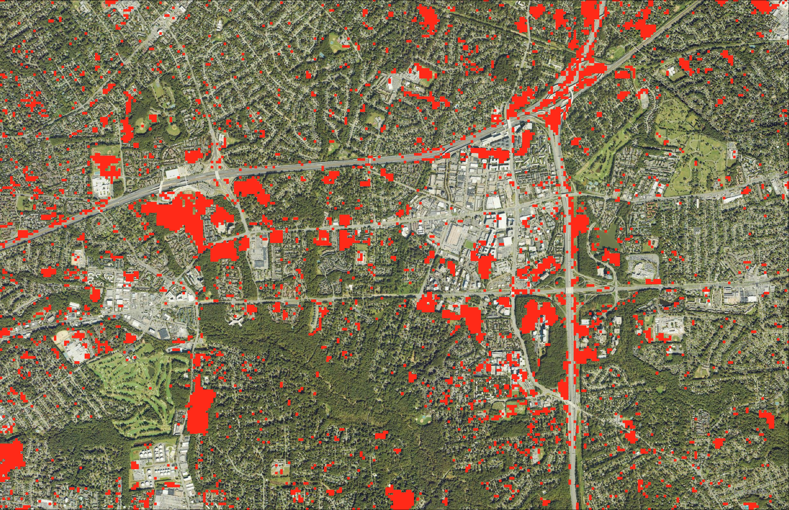
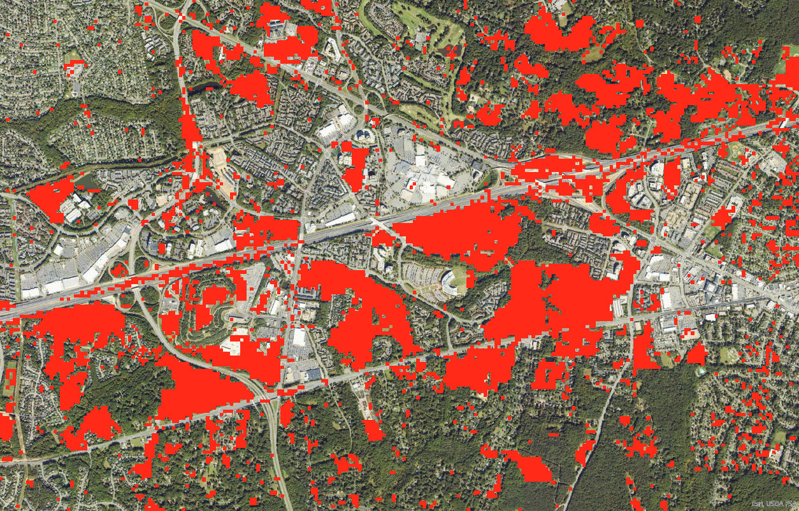
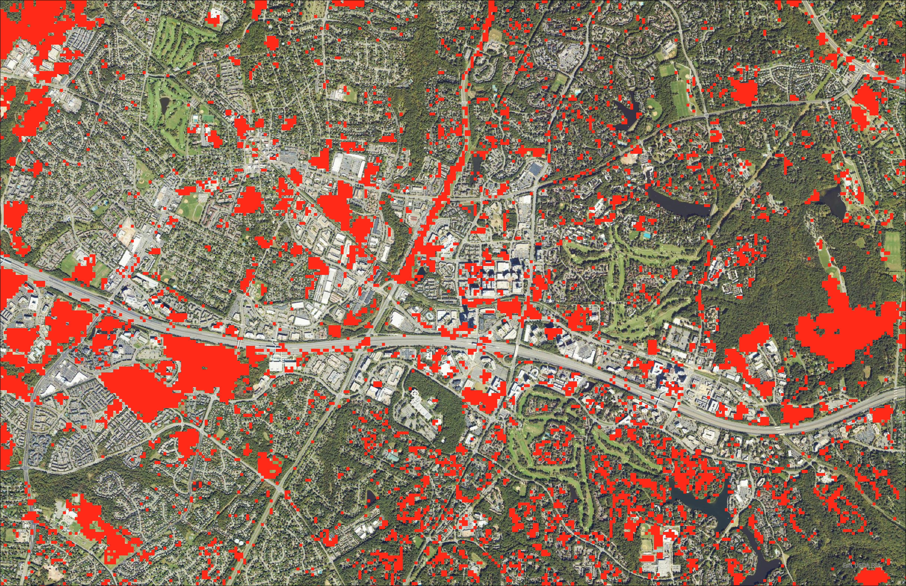

# Northern-Virginia-Development-Change

## Showing how Northern Virginia has changed over time through suburban expansion, infrastructure growth, and demographic shifts.

Northern Virginia, often called "NoVA," is a vibrant and diverse region located just across the Potomac River from Washington, D.C. It began as a collection of rural farms and colonial towns in the 1700s, with key roles in both the Revolutionary and Civil Wars. Over time, especially after World War II, the region transformed rapidly due to its close ties to the federal government. Today, it includes bustling urban centers like Arlington, Alexandria, and Fairfax, and is known for its blend of historic charm and high-tech innovation. What makes Northern Virginia unique is its mix of old and new—colonial buildings stand near ’s a place where history and progress skyscrapers, and quiet Civil War trails weave through some of the most advanced tech corridors on the East Coast. It’s a place where history and progress walk side by side. Here is a link to see the different areas of Northern Virginia:

https://ion.cesium.com/stories/viewer/?id=bfa0866e-35a4-4430-9243-bbd41a92648c

This project measures and visualizes the change and development of Northern Virginia and demonstrates the use of point clouds in GIS.

 
_Tyson Corner Lidar_

 
_Merrifield Lidar_

These Maps show the Change and Development from 2001 to 2023 in key parts of Northern Virginia. Most of the change happened in Outer parts of Northern Virgnina like Loudon, and Prince William County. The type of change that mostly happens in Northern Virginia is Farmland and forests that turn into new commercial and residential development. There is also revitalization going on in certain parts of Northern Virginia to replace old commercial development with new mixed use development in urban and suburban areas. 

 
_Northern Virginia change and development_

 
_Tysons & Mclean redevelopment_

 
_Merrifield redevelopment_

 
_FairOaks development_

 
_Reston development_

Maps made by Ryan Zuber, Spring 2025, for University of Kentucky Department of Geography 409. The maps were created using ArcGIS Pro, ArcPy, and Cesium Ion. The data is from VGIN, USGS, and fairfaxcounty.gov.ags image server using it to for NAIP, NLCD, and Lidar point cloud.
